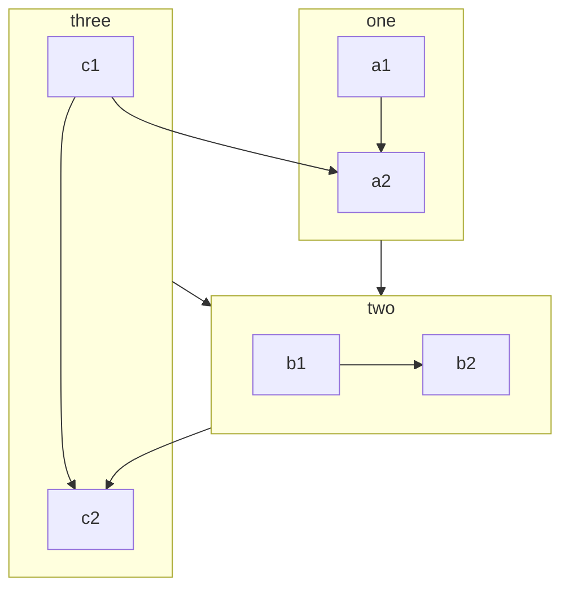

# Git
解决git clone慢的问题：
**步骤如下** 
1. [查找ip](https://www.ipaddress.com/) (github.com的ip)
2. 修改/etc/hosts文件
---

解决github图片显示问题：
**步骤如下** 
1. 将图片路径当中的**blob** 改成**raw** 
2. [原文链接](https://www.cnblogs.com/ghm-777/p/11433425.html) 
---

解决每次登录github都要账号密码的问题:
**步骤如下** 
1. git config --system --unset credential.helper
2. git config --global credential.helper store\

:arrow_forward:当输入一次用户名，密码之后，第二次就不用了。

# Markdown-->Mermaid
[学习使用mermaid](https://mermaid-js.github.io/mermaid/) 

graph

